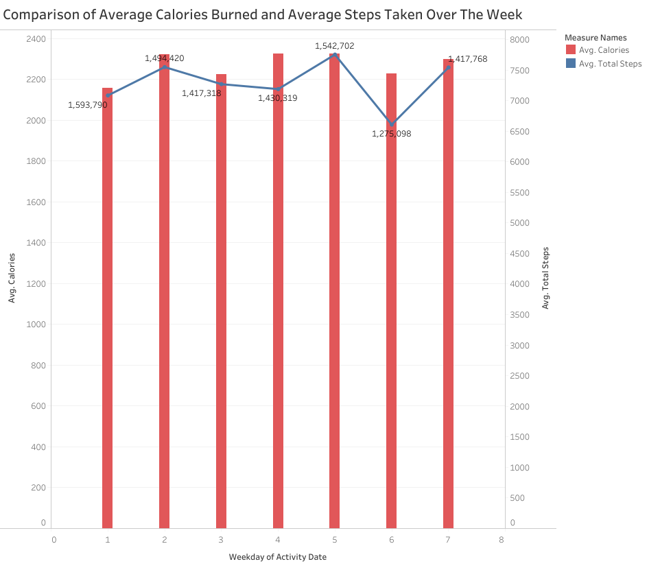
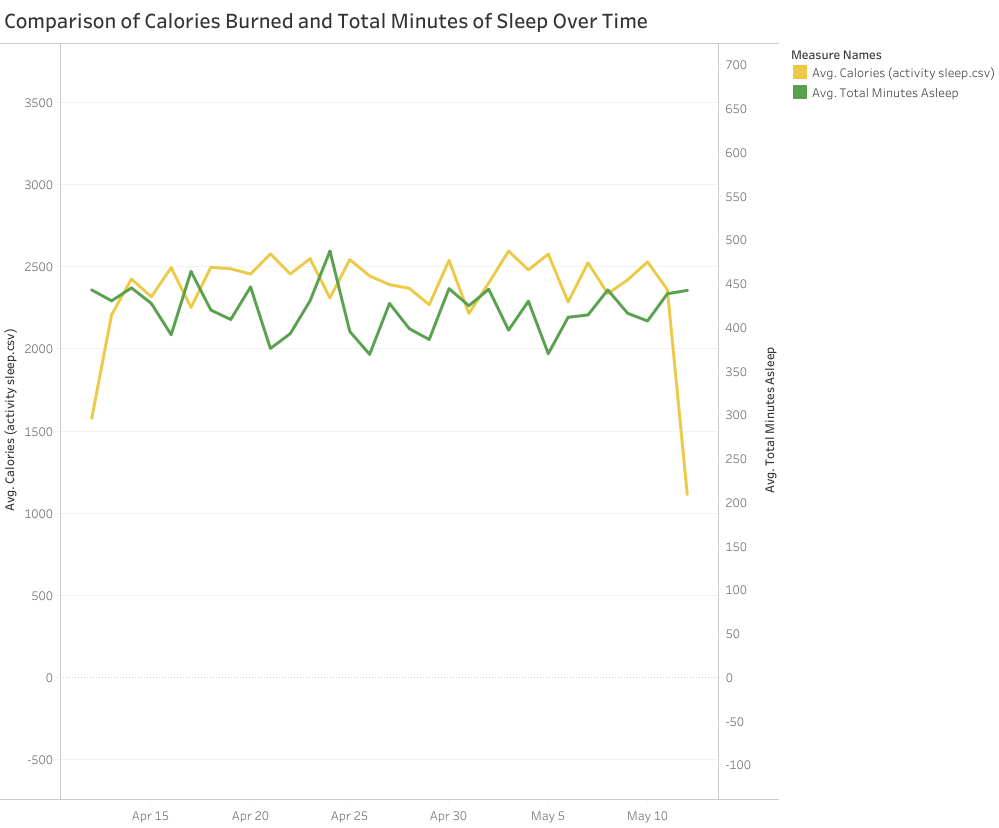

## About the company

Bellabea is a high-tech company that manufactures health-focused smart products.
Sršen used her background as an artist to develop beautifully designed technology that informs and inspires women around the world. Collecting data on activity, sleep, stress, and reproductive health has allowed Bellabeat to empower women with knowledge about their own health and habits. Since it was founded in 2013, Bellabeat has grown rapidly and quickly positioned itself as a tech-driven wellness company for women

## Questions to answer
1. What are some trends in smart device usage?

2. How could these trends apply to Bellabeat customers?

3. How could these trends help influence Bellabeat marketing strategy

## Prepare
Sršen encourages you to use public data that explores smart device users’ daily habits. She points you to a specific data set:

[FitBit Fitness Tracker Data](https://www.kaggle.com/datasets/arashnic/fitbit) (CC0: Public Domain, data set made available through Mobius): This Kaggle data set
contains personal fitness tracker from thirty fitbit users. Thirty eligible Fitbit users consented to the submission of
personal tracker data, including minute-level output for physical activity, heart rate, and sleep monitoring. It includes
information about daily activity, steps, and heart rate that can be used to explore users’ habits.

Sršen tells you that this data set might have some limitations, and encourages you to consider adding another data to help
address those limitations as you begin to work more with this data.

## Installing and Loading packages

```{r}
library(tidyverse)
library(ggplot2)
library(lubridate)
library(janitor)
library(dplyr)
```

## Importing files
```{r}
activity1 <- read_csv("dailyActivity_merged_3.12.16-4.11.16.csv")
activity2 <- read_csv("dailyActivity_merged_4.12.16-5.12.16.csv")
sleep <- read_csv("sleepDay_merged_4.12.16-5.12.16.csv")
```
Making sure everything got imported correctly.

```{r}
head(activity1)
```


## Merging files

There were different files, split between dates. I want to combine these files but wanted to confirm if files had same columns
```{r}
compare_df_cols_same(activity1, activity2)
```

Here we merged the files that had the same columns but different dates
```{r}
activity <- merge(activity1, activity2, all = TRUE)
```

Check if it merged correctly and there are no extra columns
```{r}
head(activity)
```

To merge the data's I would like to fix the format of the dates of these dataframes. I do not see the need of the Time part of the date section, so I reformated the ActivityDate and Sleep Day to just have the date

```{r}
sleep$SleepDay <- as.POSIXct(sleep$SleepDay,format='%m/%d/%y')
sleep$SleepDay <- format(sleep$SleepDay, format="%m/%d/%Y")

activity$ActivityDate <-as.POSIXct(activity$ActivityDate,format='%m/%d/%y')
activity$ActivityDate <- format(activity$ActivityDate, format="%m/%d/%Y")
```


I wanted to compare the calories, acivity level, and sleep so I merged activity and sleep dataframes. I also wanted the averages of those values by different user's(Id's) as well.
```{r}
activity_sleep <- merge(x = activity, y = sleep, by.x = c("Id", "ActivityDate"), by.y = c("Id", "SleepDay"))
average <- activity_sleep %>% group_by(Id) %>% 
  summarise (avgSteps = mean(TotalSteps), avgDistance = mean(TotalDistance), avgCalories = mean(Calories), avgSedentary = mean(SedentaryMinutes), avgSleep = mean(TotalMinutesAsleep))
```

After viewing the datasets, there was a column in the activity and activity_sleep that can be removed which is the SedentaryActiveDistance

```{r}
activity_sleep = subset(activity_sleep, select = -c(SedentaryActiveDistance))
```


## Summarizing Data

Checking the amount of user's are in each data set
```{r}
length(unique(activity$Id))
length(unique(sleep$Id))
length(unique(activity_sleep$Id))
length(unique(average$Id))

```


As we can see we have 35 user's for activity data set and 24 users for the sleep data set.

##### Checking all my data set summaries
```{r}
activity %>% select(TotalSteps, TotalDistance, Calories, SedentaryMinutes) %>% summary()
sleep %>% select(TotalSleepRecords, TotalMinutesAsleep, TotalTimeInBed) %>% summary()
```

## Exporting Data
Exporting data to use in Tableu
```{r}
#write.csv(acvitity, "activity")
#write.csv(activity_sleep, "activity_sleep")
#write.csv(average, "average")
```

## Visualization

If you would like to view this table in [Tableu](https://public.tableau.com/views/CaseStudy1_Step_vs_Cal/Sheet1?:language=en-US&publish=yes&:sid=&:display_count=n&:origin=viz_share_link)


This graph is a shows the amount calories burned and the amount of steps taken by a user throughout the week. As we can see there is a correlation to how many more calories are burned while having more steps taken.

```{r}
ggplot(data=activity, aes(x = TotalSteps, y = Calories)) + geom_point() + geom_smooth()
```

Here is another graph comparing the same two variables, the amount of calories burned and the amount of steps taken by a user, but this time in scatter plot format. Again this shows a correlation between the two variables, which makes sense because the more activity/steps you take the more calories you burn.


If you would like to view this table in [Tableu](https://public.tableau.com/views/CaseStudy1_Cal_vs_Sleep/Sheet2?:language=en-US&publish=yes&:sid=&:display_count=n&:origin=viz_share_link)


This graph highlights the the calories burned in a day and the amount in minutes of the sleep a user had that day. I wanted to see if there was a correlation between calories burnt and the amount of sleep a user had but from the graph shown there is no correlation in this data.


```{r}
ggplot(data = average, aes(x = avgSedentary, y = avgSleep)) + geom_point() + geom_smooth()
```

Here is a scatter plot showing the average amount of sedentary minutes an individual has and the average amount of minutes a person is asleep for the day. This graph does show that there is a correlation between the amount of time they are not active and the amount of sleep they are getting. From the trend line it is showing that the less the person sleeps the more they are sedentary for that day.

## Summary

##### Analysis Workflow

* Data was imported, cleaned, and reformatted using R packages such as ***tidyverse***, ***lubridate***, and ***janitor***. 
* Data was visualized using **Tableu** and R packages such as ***ggplot2***. These visualization were created to explore relationships between steps taken, calories burned, sedentary time, and sleep patterns. 

##### Key Findings

1. **Activity and Calorie Expenditure:** There is a positive correlation between the number of steps taken and calories burned. Which makes sense, the more activity you do the more calories are burned. 
2. **Lack of Correlation Between Sleep and Calorie Expenditure**: No apparent correlation was found between the amount of sleep a user gets and their daily calorie expenditure. This finding can be due to the lack of data in the data set, we can explore these variables again if we have more data sets that we can work with. 
3. **Sedentary activity and sleep:** There is an inverse relationship between sedentary minutes and sleep duration. The more user's spend time being sedentary the less activity of sleep they get. We can use this information to notify user's to either go to sleep or get up and start their day. This can be used to help with their sleep schedule or to help be more active.

##### What this means?

1. **Marketing Strategy:** The positive correlation between activity levels and calories burned can be used in marketing campaigns to promote Bellabeat products as tools for achieving fitness goals. 

2. **New Product Development:** Insights into the relationship between sedentary behavior and sleep could be used to help guide the development of features that encourage more active lifestyles and better sleeping patterns for users. 

**Recommendations**

* Tailor marketing messages that emphasize the health benefits of staying active and using smart devices to track fitness goals due to the correlation of activity and calorie expenditure. 

* Develop features or apps that prompt users to reduce sedentary time and potentially enhance sleep quality and overall wellness. 

* It would be beneficial in the future for BellaBeat to consider integrating more diverse data sources since there is limitations in the current data set.

### Conclusion
The analysis provides valuable insights that could help BellaBeat tailor its products and marketing strategies to better meet the needs of its target audience, promoting a healthier lifestyle.

## Thank you
Thank you for your interest in my BellaBeat Case Study!
This is my first project or case study using R and Tableu. If you have any critiques, comments, or recommendations, I would really appreciate them!
